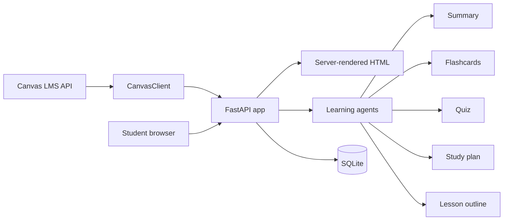

# Canvas Co-Pilot

Canvas Co-Pilot is a Python study assistant for Canvas LMS. It connects to Canvas with a student access token, reads course context, and generates learning artifacts such as summaries, flashcards, quizzes, study plans, lesson outlines, and intervention signals.

This repository was migrated from a JavaScript/React/Node prototype into a Python-first application. The current implementation uses FastAPI, server-rendered HTML, SQLite, and Python learning-agent modules.

## Why This Project Exists

Canvas is useful for storing course content, but students still have to decide what changed, what matters, and what to study next. Canvas Co-Pilot reduces that manual overhead by turning course material into action-oriented study support.

The app is designed for portfolio-style data and AI engineering practice:

- Canvas API integration
- token-based user sessions
- workflow persistence in SQLite
- agent-style study artifact generation
- intervention scoring from assignment performance
- a clean Python web application structure

## What The App Does

1. Logs in with a Canvas Personal Access Token.
2. Fetches active Canvas courses.
3. Shows assignments, modules, files, and performance signals.
4. Generates study outputs from pasted course material.
5. Saves workflow history locally in SQLite.
6. Exposes both browser pages and JSON API endpoints.

## Architecture



## Data Flow

| Step | Component | Description |
| --- | --- | --- |
| Login | `canvas_copilot.app` | Accepts a Canvas base URL and access token. |
| Canvas access | `canvas_copilot.canvas_client` | Fetches profile, courses, assignments, modules, and files. |
| Generation | `canvas_copilot.agents` | Builds summaries, flashcards, quizzes, plans, lessons, and risk signals. |
| Storage | `canvas_copilot.storage` | Stores users, sessions, events, preferences, and workflow runs in SQLite. |
| UI | Jinja templates | Renders pages without a JavaScript frontend build step. |

## Project Structure

```text
.
+-- README.md
+-- pyproject.toml
+-- .env.example
+-- canvas_copilot
|   +-- app.py
|   +-- agents.py
|   +-- canvas_client.py
|   +-- config.py
|   +-- storage.py
|   +-- static
|   |   +-- styles.css
|   +-- templates
|       +-- base.html
|       +-- index.html
|       +-- login.html
|       +-- courses.html
|       +-- course_detail.html
|       +-- workspace.html
|       +-- history.html
+-- tests
    +-- test_agents.py
```

## Tech Stack

- Python 3.11+
- FastAPI
- Uvicorn
- Jinja2
- SQLite
- Requests
- Pytest

## Prerequisites

Install:

- Python 3.11 or later
- Git
- A Canvas Personal Access Token, unless using demo mode

## Setup

Clone the repository:

```bash
git clone https://github.com/arollaramreddy/Canvas_Co-pilot.git
cd Canvas_Co-pilot
```

Create and activate a virtual environment:

```bash
python3 -m venv .venv
source .venv/bin/activate
```

Install the app:

```bash
pip install -e .
```

Create the local environment file:

```bash
cp .env.example .env
```

Edit `.env`:

```env
APP_SECRET_KEY=change_me_to_a_long_random_secret
CANVAS_BASE_URL=https://canvas.asu.edu/api/v1
DATA_DIR=data
HOST=127.0.0.1
PORT=8000
DEMO_MODE=false
```

## How To Run

Start the Python web app:

```bash
uvicorn canvas_copilot.app:app --reload --host 127.0.0.1 --port 8000
```

Open:

```text
http://127.0.0.1:8000
```

You can also use the installed console command:

```bash
canvas-copilot
```

## Demo Mode

To explore the app without Canvas credentials, set:

```env
DEMO_MODE=true
```

Then open `/login` and submit the token value:

```text
demo
```

The app will show sample courses, assignments, files, modules, intervention scoring, and workflow generation.

## Main Pages

| Page | Purpose |
| --- | --- |
| `/` | Product overview and recent workflow runs. |
| `/login` | Connect with Canvas token or demo token. |
| `/courses` | List active Canvas courses. |
| `/courses/{course_id}` | Show assignments, modules, files, and risk signals. |
| `/workspace` | Generate summaries, flashcards, quizzes, study plans, and lessons. |
| `/history` | Review saved workflow runs. |

## API Endpoints

| Endpoint | Method | Description |
| --- | --- | --- |
| `/api/auth/me` | GET | Returns the active session user. |
| `/api/courses` | GET | Lists Canvas courses. |
| `/api/courses/{course_id}/assignments` | GET | Lists assignments and intervention score. |
| `/api/agentic-workflow` | POST | Generates a full or selected workflow from text. |
| `/api/study-plan` | POST | Generates a study plan. |
| `/api/quizzes/generate` | POST | Generates quiz questions. |
| `/api/workflow-runs` | GET | Lists saved workflow runs. |

Example workflow request:

```bash
curl -X POST http://127.0.0.1:8000/api/agentic-workflow \
  -H "Content-Type: application/json" \
  -d '{"workflow_type":"agentic","title":"Module review","source_text":"Paste course material here"}'
```

The API requires a logged-in browser session. Use the web login first, or extend the app with API-token authentication for external clients.

## Canvas Token Notes

This project uses a Canvas Personal Access Token because it is simpler for a portfolio or local prototype than institutional OAuth.

Typical Canvas token path:

```text
Canvas -> Account -> Settings -> Approved Integrations -> New Access Token
```

The token is stored in your local SQLite database under `DATA_DIR`. Do not commit `.env`, `data/`, or database files.

## Testing

Run the unit tests:

```bash
python -m unittest discover -s tests
```

Run a syntax check:

```bash
python -m compileall canvas_copilot tests
```

## What Changed From The JavaScript Version

- Replaced the React/Vite frontend with server-rendered FastAPI pages.
- Replaced the Express backend with Python FastAPI routes.
- Replaced JavaScript agent modules with Python functions in `canvas_copilot.agents`.
- Removed tracked generated audio files and Node package files.
- Kept the product idea: Canvas-aware study support, workflow history, and student intervention signals.

## Production Readiness Notes

This is a local-first Python prototype. For production, add:

- institutional OAuth instead of Personal Access Token login
- encrypted token storage
- persistent server-side session storage
- stronger PDF text extraction
- real LLM integration with structured output validation
- background jobs for long-running workflows
- role-based access control
- deployment configuration for Cloud Run, ECS, or Kubernetes

## Team

- Niharika Ravilla
- Ram Reddy
- Suraj Shinde
